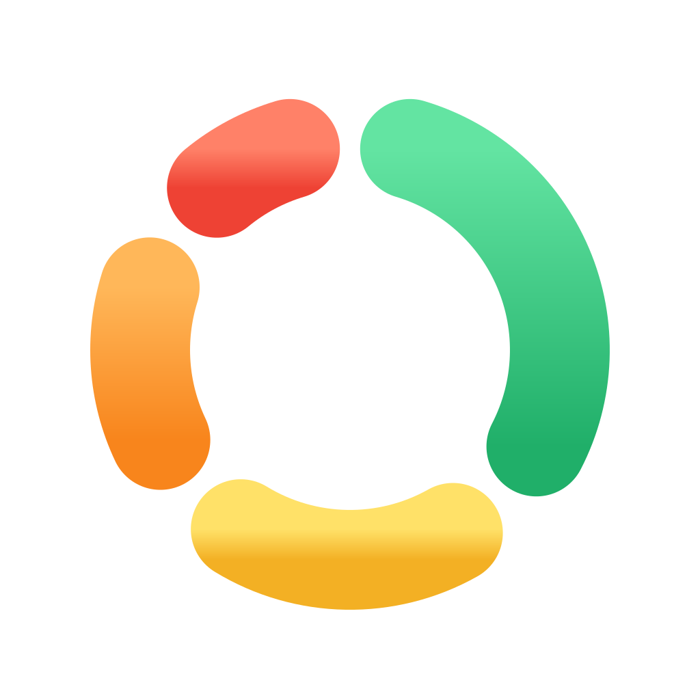
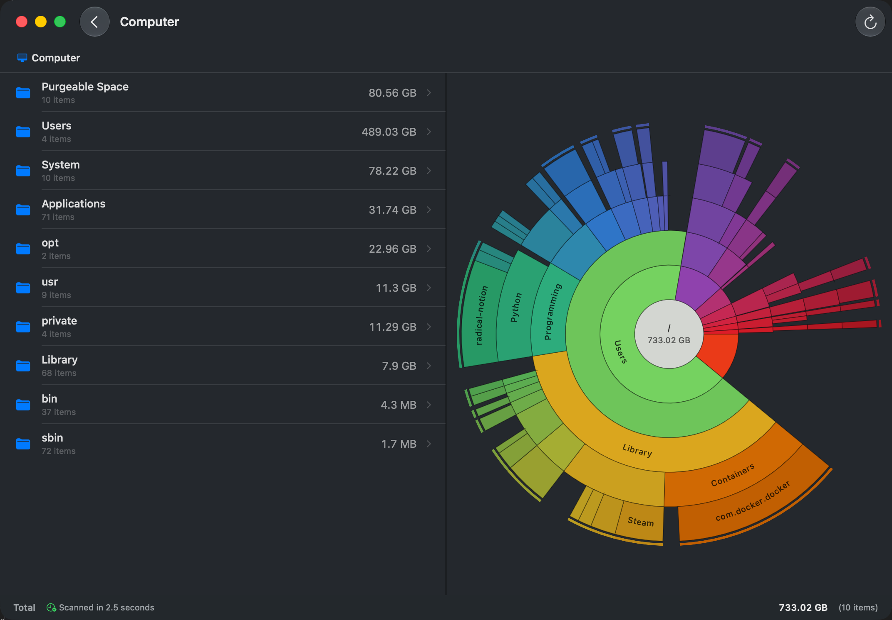
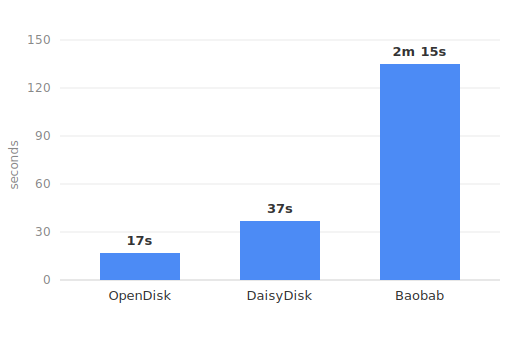

<div align="center">



<h1>OpenDisk</h1>

A fast, free, and **open-source** disk space analyzer for macOS — an open alternative to DaisyDisk. Maps your drive as an interactive sunburst chart, scanning a full disk in seconds and streaming results live as it runs.

[](https://github.com/137137137/OpenDisk/releases/latest)
[](LICENSE)
[](https://www.apple.com/macos/)

**[⬇&nbsp;&nbsp;Download for macOS](https://opendisk.app)** &nbsp;·&nbsp; [GitHub releases](https://github.com/137137137/OpenDisk/releases/latest)

Unzip and launch — OpenDisk offers to move itself into Applications, and keeps itself up to date automatically.



</div>

## Features

- Interactive sunburst chart, where each ring is one level deeper into the tree.
- Hover any slice to see its exact size, click to zoom into that folder.
- Sortable, Finder-style folder list beside the chart, with breadcrumbs.
- Results stream in live during the scan, so the chart and list fill in as it runs.
- Incremental rescans reuse the previous scan and replay filesystem events, so a repeat scan is 20–28x faster than a cold one.
- Understands APFS volume groups, firmlinks, purgeable space, and system volumes, so the total matches what your Mac reports as used.
- Instant search across the whole scanned tree — results appear as you type, even on drives with millions of files.
- Collector: drag files and folders into it from anywhere in the app, review the reclaimed total, and delete them in one action.
- Purgeable-space breakdown shows caches and other reclaimable storage.
- External drives appear automatically when connected.
- Keeps itself up to date automatically (via Sparkle).

## Why OpenDisk?

The DaisyDisk-style sunburst you know — but **free**, **open source**, and **faster**.

| | OpenDisk | DaisyDisk |
| :-- | :-: | :-: |
| Price | **Free** | Paid |
| License | **Open source (MIT)** | Proprietary |
| Interactive sunburst | ✓ | ✓ |
| 1 TB cold scan | **17s** | 37s |

## Benchmarks

Full scan of a 1 TB Apple Silicon volume, cold cache.

<div align="center">



<table align="center">
<thead>
<tr><th align="left">Tool</th><th align="center">1 TB scan</th><th align="left">Relative</th></tr>
</thead>
<tbody>
<tr><td align="left">OpenDisk</td><td align="center">17s</td><td align="left">1x</td></tr>
<tr><td align="left">DaisyDisk</td><td align="center">37s</td><td align="left">2.2x slower</td></tr>
<tr><td align="left">Baobab</td><td align="center">2m 15s</td><td align="left">~8x slower</td></tr>
</tbody>
</table>

</div>

## Requirements

- macOS 26 (Tahoe) or later, on Apple Silicon or Intel.
- Full Disk Access, otherwise macOS hides parts of the filesystem and the totals come up short. Grant it in **System Settings → Privacy & Security → Full Disk Access**. The app prompts for it on first launch.

## Building

Open `OpenDisk.xcodeproj` in Xcode and run, or build from the command line:

```sh
xcodebuild -project "OpenDisk.xcodeproj" -scheme "OpenDisk" build
```

## Usage

1. Launch OpenDisk and grant **Full Disk Access** when prompted, so nothing is hidden from the scan.
2. Pick a drive, or choose **Scan Folder…** to analyze any directory.
3. Explore the sunburst — hover a slice for its exact size, click to zoom in, and use the breadcrumbs or folder list to step back out.
4. Open **Purgeable Space** to see caches and other reclaimable storage broken down.

## How it works

- Reads directory metadata in bulk with `getattrlistbulk(2)` and `searchfs(2)` instead of one `stat` per file.
- Uses a small number of concurrent readers (4–5 for subtrees, ~8 for a whole volume), since APFS serializes directory reads and throughput drops off past that point.
- Runs the blocking reads on a fixed pool of dedicated worker threads pulling from a shared work stack.
- Stops at mount points and snapshot volumes using a per-child mount flag, so scanning `/` does not count the disk twice.

## Contributing

If you want, you can fork the code, make improvements and submit a pull request to improve the app. Accepting a PR is solely in the hands of the maintainer. Before making fundamental changes expecting them to be accepted, please consult the maintainer of the project first.

## Project layout

```
OpenDisk/
├── App/                    App entry point
├── Models/                 Folder items, chart data, scan progress
├── Services/
│   ├── DiskAnalyzer.swift  Top-level scan orchestration
│   └── Scanning/           Scanner core
│       ├── ScanEngine.swift        Strategy selection and streaming snapshots
│       ├── TraversalScanner.swift  getattrlistbulk worker pool
│       ├── CatalogScanner.swift    searchfs catalog scans
│       ├── ScanCache.swift         Incremental rescan cache
│       └── SystemInterop/          Wrappers over the kernel APIs
├── Views/
│   ├── Charts/             Sunburst rings chart
│   ├── Analysis/           Results screen
│   └── Components/         Rows, breadcrumbs, status bar
└── Resources/              Assets and icons
```

## License

Released under the [MIT License](LICENSE).
