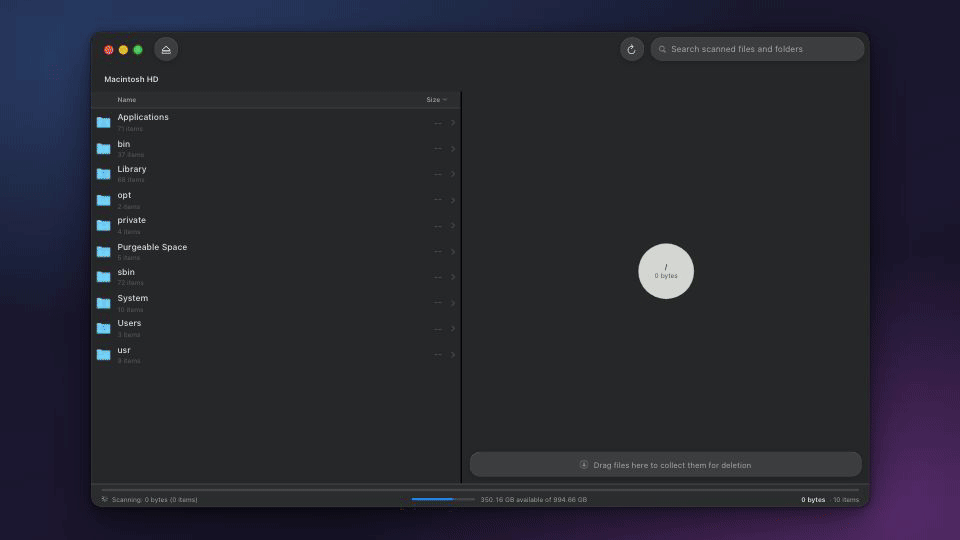

<div align="center">

<picture>
  <source media="(prefers-color-scheme: dark)" srcset="docs/logo-dark.svg">
  
</picture>

<p>See what's filling up your Mac and clear it out. Free and open source.</p>

[](https://github.com/137137137/OpenDisk/releases/latest)
[](LICENSE)
[](#install)

<a href="https://opendisk.app"><b>Download</b></a> &nbsp;·&nbsp;
<a href="https://apps.apple.com/app/opendisk/id6793260558">Mac App Store</a> &nbsp;·&nbsp;
<a href="https://formulae.brew.sh/cask/opendisk">Homebrew</a>

<br/><br/>



</div>

OpenDisk scans your drive and shows you where the space went, so you can find the big stuff and delete it. It's a free alternative to DaisyDisk, and it scans about twice as fast.

## Install

**Download** from [opendisk.app](https://opendisk.app), unzip, and open it. It offers to move itself into Applications and updates itself.

**Homebrew**

```sh
brew install --cask opendisk
```

**Mac App Store:** [OpenDisk on the App Store](https://apps.apple.com/app/opendisk/id6793260558). Apple's sandbox means this version only scans the drives and folders you pick, so the download is the better choice if you want to scan your whole Mac.

Requires macOS 15 or later, on Apple Silicon or Intel.

## What you can do with it

- Scan a 1 TB drive in about 17 seconds. Results fill in while it's still scanning.
- Rescan in a couple of seconds, because OpenDisk only looks at what changed since last time.
- Click into any folder to dig deeper, and hover to see exact sizes.
- Search every file on the drive by name, with results as you type.
- Drag things you don't need into the Collector, see how much space you'll get back, and delete them all at once.
- See purgeable space and caches, so the numbers match what macOS reports.
- See external drives as soon as you plug them in.

## Speed

Full scan of a 1 TB drive on an Apple Silicon Mac, with a cold cache.

| App | Time |
| :-- | --: |
| **OpenDisk** | **17s** |
| DaisyDisk | 37s |

Rescanning the same drive with OpenDisk is 20 to 28 times faster than the first scan.

## Good to know

**Why does it need Full Disk Access?** Without it, macOS hides parts of the disk and the totals come up short. OpenDisk asks on first launch. You can also turn it on in System Settings > Privacy & Security > Full Disk Access.

**Is deleting safe?** Deleting from the Collector is permanent and skips the Trash, so check what's in it first. OpenDisk won't let you delete system folders, your home folder, or your Library.

**Does it send any data?** No. The downloaded version checks opendisk.app for updates, and that's the only network request it makes. There are no analytics or accounts.

## Build from source

You need Xcode 26 or later.

```sh
git clone https://github.com/137137137/OpenDisk.git
cd OpenDisk
xcodebuild -project OpenDisk.xcodeproj -scheme OpenDisk CODE_SIGNING_ALLOWED=NO build
```

Or open `OpenDisk.xcodeproj` in Xcode and press Run.

## How it's fast

- It reads directory entries in bulk with `getattrlistbulk(2)` instead of calling `stat` on every file.
- It runs a small pool of readers, about 8 for a whole drive. APFS locks directory reads, so adding more threads makes it slower.
- It stops at mount points and snapshots, so scanning `/` never counts the same disk twice.
- It keeps each finished scan and replays filesystem events on the next run, so it only rescans folders that changed.

## Contributing

Bug reports and pull requests are welcome. For bigger changes, open an issue first so we can agree on the approach.

To report a security problem, please follow the [security policy](SECURITY.md) instead of opening a public issue.

## License

[MIT](LICENSE). The Full Disk Access check is adapted from [inket/FullDiskAccess](https://github.com/inket/FullDiskAccess), and updates use [Sparkle](https://sparkle-project.org).
